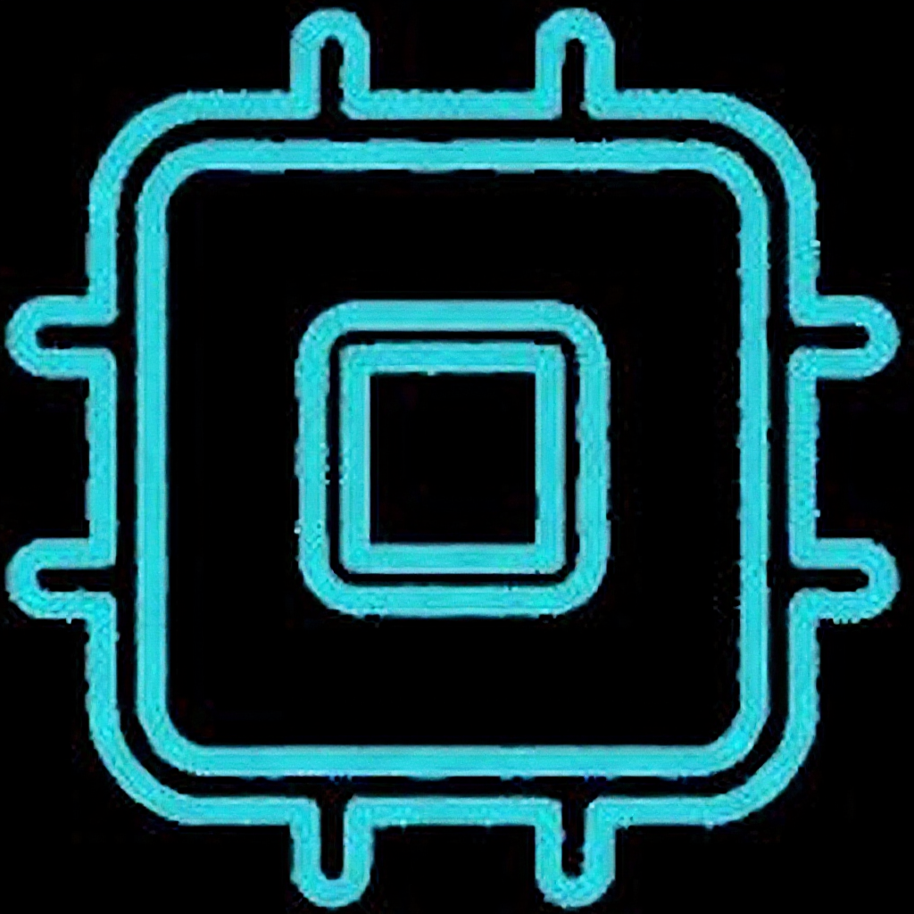

<div align="center">



# HireMind — AI-Powered Interview Platform

**Conduct intelligent, proctored, context-aware virtual interviews — powered by RAG and real-time AI evaluation.**

[](https://react.dev/)
[](https://www.typescriptlang.org/)
[](https://fastapi.tiangolo.com/)
[](https://supabase.com/)
[](https://vitejs.dev/)

</div>

---

## 📌 Overview

**HireMind** is a full-stack AI interview platform that automates the technical interview process end-to-end. Candidates upload their resume, and the system generates a personalized interview — asking context-aware questions derived directly from their documents using a **RAG (Retrieval-Augmented Generation)** pipeline. Candidate responses are evaluated in real-time, and a built-in **face-detection proctoring system** monitors the session for anti-cheat compliance.

> Built as **OLABS** — a capstone-grade project combining modern LLM tooling, real-time video monitoring, and a polished React frontend.

---

## ✨ Features

| Feature | Description |
|---|---|
| 📄 **Resume-Aware Interviews** | Upload a resume (+ optional docs) → AI generates contextual questions via RAG |
| 🤖 **Real-Time Answer Evaluation** | Each answer is processed live; next question adapts dynamically |
| 🎥 **Proctoring / Face Monitor** | Camera feed analyzed for face count — flags multiple faces or no presence |
| 🔐 **Auth & Session Management** | Supabase-backed auth with per-user session IDs tracking interview state |
| 📊 **Scoring & Analytics** | Recharts-powered visual feedback on interview performance |
| 🧩 **Clean Component UI** | Built with Shadcn UI + Radix primitives + Framer Motion animations |

---

## 🗂️ Project Structure

```
OLABS/
├── frontend/                  # React 18 + TypeScript + Vite
│   ├── src/
│   │   ├── components/        # Shadcn UI + custom components
│   │   ├── pages/             # Route-level views
│   │   ├── hooks/             # TanStack Query hooks
│   │   └── lib/               # Supabase client, utils
│   ├── tailwind.config.ts
│   └── vite.config.ts
│
└── backend/                   # Python FastAPI (HireMind AI Backend)
    ├── main.py                # FastAPI app + Uvicorn entry
    ├── routers/               # API route handlers
    ├── services/
    │   ├── rag_pipeline.py    # Vector store builder + retrieval
    │   ├── interview.py       # Question generation & answer eval
    │   └── face_monitor.py    # Camera feed analysis
    └── requirements.txt
```

---

## 🧱 Tech Stack

### Frontend
- **React 18** + **TypeScript** — component framework
- **Vite** — fast dev/build tooling
- **Tailwind CSS** + **Shadcn UI** (`@radix-ui`) — styling and accessible components
- **Framer Motion** — interview UI animations
- **Recharts** — score visualization
- **TanStack React Query** — server state management
- **React Router DOM** — client-side routing
- **Supabase JS** — auth and database client

### Backend
- **FastAPI** + **Uvicorn** — async Python REST API
- **RAG Pipeline** — document ingestion → vector store → context-aware LLM querying
- **Face Detection** — real-time camera frame analysis for proctoring

### Infrastructure
- **Supabase** — authentication, session storage, user management

---

## 🚀 Getting Started

### Prerequisites

- Node.js ≥ 18
- Python ≥ 3.10
- Supabase project (get keys from [supabase.com](https://supabase.com))

---

### 1. Clone the repo

```bash
git clone https://github.com/Shardul0x/OLABS.git
cd OLABS
```

---

### 2. Backend Setup

```bash
cd backend
python -m venv venv
source venv/bin/activate        # Windows: venv\Scripts\activate
pip install -r requirements.txt
```

Create a `.env` file in `/backend`:

```env
SUPABASE_URL=your_supabase_url
SUPABASE_KEY=your_supabase_service_key
OPENAI_API_KEY=your_openai_key        # or whichever LLM provider
```

Start the backend:

```bash
uvicorn main:app --reload --port 8000
```

API will be live at `http://localhost:8000`. Docs at `http://localhost:8000/docs`.

---

### 3. Frontend Setup

```bash
cd frontend
npm install
```

Create a `.env` file in `/frontend`:

```env
VITE_SUPABASE_URL=your_supabase_url
VITE_SUPABASE_ANON_KEY=your_supabase_anon_key
VITE_API_BASE_URL=http://localhost:8000
```

Start the dev server:

```bash
npm run dev
```

Frontend at `http://localhost:5173`.

---

## 🔄 Interview Flow

```
Candidate registers / logs in (Supabase Auth)
        ↓
Uploads resume + optional documents
        ↓
Backend builds vector store (RAG pipeline)
        ↓
Interview session created (unique session ID)
        ↓
AI generates first question from document context
        ↓
Candidate answers → backend evaluates → next question
        ↓
Face monitor runs in parallel (proctoring)
        ↓
Session ends → scoring dashboard shown
```

---

## 📡 API Endpoints (FastAPI)

| Method | Endpoint | Description |
|---|---|---|
| `POST` | `/session/start` | Upload docs, create interview session |
| `GET` | `/session/{id}/question` | Get next AI-generated question |
| `POST` | `/session/{id}/answer` | Submit answer, receive evaluation |
| `GET` | `/session/{id}/result` | Fetch final score and report |
| `POST` | `/proctor/frame` | Submit camera frame for face detection |

> Full interactive docs available at `/docs` (Swagger UI) when backend is running.

---

## 🛡️ Proctoring System

The face monitor analyzes individual frames from the candidate's webcam feed:

- ✅ **1 face detected** → session continues normally
- ⚠️ **0 faces detected** → flags candidate as absent / looking away
- 🚨 **2+ faces detected** → flags potential external assistance

All flags are logged against the session ID for post-interview review.

---

## 🤝 Contributing

```bash
# Fork → clone → branch
git checkout -b feat/your-feature

# Make changes, then
git commit -m "feat: describe your change"
git push origin feat/your-feature

# Open a PR
```

---

## 📄 License

This project is licensed under the **MIT License**. See [`LICENSE`](./LICENSE) for details.

---

<div align="center">

Built by [Shardul Bangale](https://github.com/Shardul0x) · VIIT Pune · 2025

</div>
